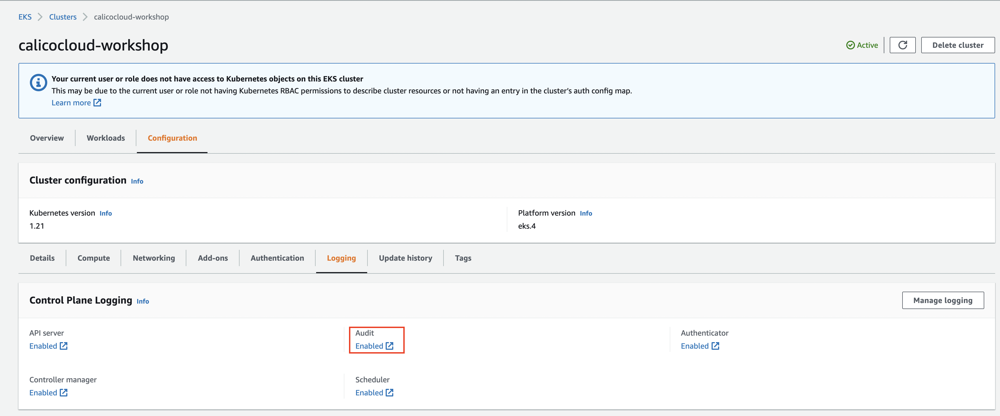
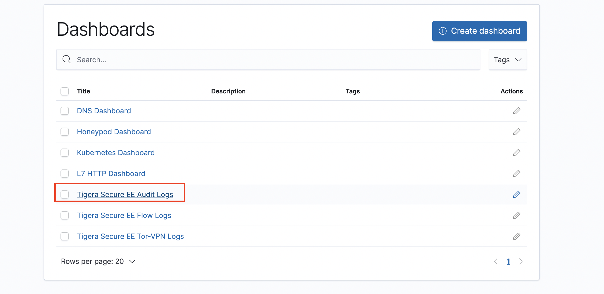
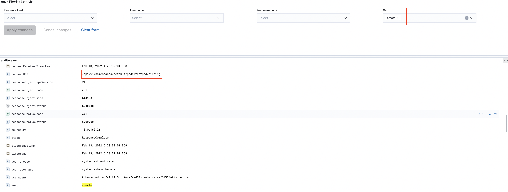

# Enable Kubernetes audit logs

> Kubernetes resources are used in Calico Enterprise compliance reports and other audit-related features, but they are not enabled by default. You must enable Kubernetes resources through the Kubernetes API server. If you miss this step, some compliance reports will not work, and audit trails will not provide a complete view to your security team.

**Goal:** Enable Kubernetes audit logs in your cluster and review them with Timeline dashboard & Kibana dashboard

**Docs:** https://docs.tigera.io/visibility/elastic/kube-audit

## Steps


### For EKS cluster


1. Confirm your EKS have audit log enabled in cloudwatch. 

  > This demo EKS cluster enable Amazon Cloudwatch logs during creatation. 

   


2. Update Calico Enterprise log collector with EKS values.

   ```bash
   cat > configs/cloudwatch.yaml << EOF
   apiVersion: operator.tigera.io/v1
   kind: LogCollector
   metadata:
     name: tigera-secure
   spec:
     additionalSources:
       eksCloudwatchLog:
       # fetchInterval: Interval in seconds for Calico Enterprise to get logs from Cloudwatch. Default: 60 seconds.
       # groupName: Name of the Log Group (value from “Enable audit logs in EKS”)
       # region: AWS region where EKS cluster is hosted (value from “Enable audit logs in EKS”)
       # streamPrefix: Prefix of Log Stream (value from “Enable audit logs in EKS”)
         fetchInterval: 60
         groupName: /aws/eks/calicocloud-workshop/cluster
         region: us-east-2  #
         streamPrefix: kube-apiserver-audit-
   status:
     state: Ready
   EOF
   ```

   ```bash
   kubectl apply -f configs/cloudwatch.yaml
   ```

3. Prepare your AWS key pair and create a secret for tigera-operator for retrieving cloudwatch logs
   > You can create a restricted AWS user for compliance reporting, we will use the `admin` user for testing purpose.

   ```bash
   ACCESS_KEY_ID="<YOUR-AWS-ACCESS-KEY-ID>"
   ACCESS_KEY_SECRET="<YOUR-AWS-ACCESS-KEY-KEY-SECRET>"
   ```

   ```bash
   kubectl apply -f - <<EOF
   apiVersion: v1
   kind: Secret
   metadata:
     name: tigera-eks-log-forwarder-secret
     namespace: tigera-operator
   type: Opaque
   data:
     aws-id: $(echo -n ${ACCESS_KEY_ID} | base64 -w0)
     aws-key: $(echo -n ${ACCESS_KEY_SECRET} | base64 -w0)
   EOF
   ```

4. Run a test pod and review the audit log in `Kibana` 
   ```bash
   kubectl run testpod --image=nginx   
   ```

    

    


[Next -> Non K8S node segmentation](../modules/non-k8s-node-segmentation.md)

[Menu](../README.md)