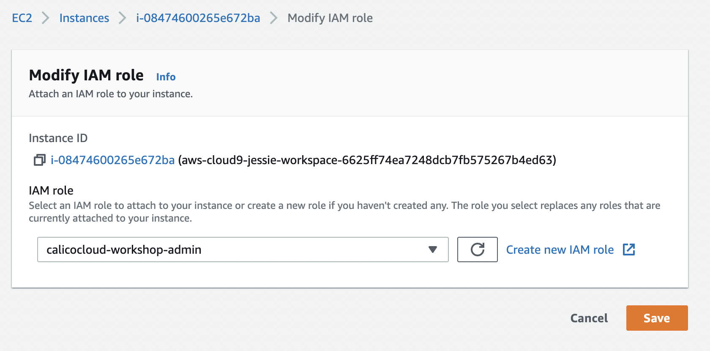

# Step 1: Setting up cloud9 work environment

**Goal:** Set up and configure your cloud9 instance to work with AWS resources.


1. Create Cloud9 workspace environment.

    To configure a Cloud9 instance, open AWS Console and navigate to `Services` > `Cloud9`. Create environment in the desired region. You can use all the default settings when creating the environment, but consider using `t3.small` instance as the `t2.micro` instance could be a bit slow. You can name it as `tigera-workshop` to quickly find it in case you have many `Cloud9` instances. It usually takes only a few minutes to get the Cloud9 instance running.

2. Ensure your environment has these tools:

    - [AWS CLI](https://docs.aws.amazon.com/cli/latest/userguide/cli-chap-install.html)
    - [Git](https://git-scm.com/book/en/v2/Getting-Started-Installing-Git)
    - [eksctl](https://docs.aws.amazon.com/eks/latest/userguide/eksctl.html)
    - [EKS kubectl](https://docs.aws.amazon.com/eks/latest/userguide/install-kubectl.html)
    - `jq` and `netcat` utilities

    Check whether these tools are already present in your environment. If not, install the missing ones.

    ```bash
    # run these commands to check whether the tools are installed in your environment
    aws --version
    git --version
    eksctl version
    kubectl version --short --client

    # install jq and netcat
    sudo yum install jq nc -y
    jq --version
    nc --version
    ```

    >If the `aws` version is `1.x`, upgrade it to version `2.x`.

    ```bash
    curl "https://awscli.amazonaws.com/awscli-exe-linux-x86_64.zip" -o "awscliv2.zip"
    unzip awscliv2.zip
    sudo ./aws/install
    # reload bash shell
    . ~/.bashrc
    aws --version
    ```

    >For convenience consider configuring [autocompletion for kubectl](https://kubernetes.io/docs/tasks/tools/included/optional-kubectl-configs-bash-linux/#enable-kubectl-autocompletion).

3. Download this repo into your environment:

    ```bash
    git clone https://github.com/tigera-solutions/calicocloud-kaas-workshop-demo.git

    cd calicocloud-kaas-workshop-demo
    ```

4. Configure AMI role for Cloud9 workspace.

    >This is necessary when using a Cloud9 environment which has an IAM role automatically associated with it. You need to replace this role with a custom IAM role that provides necessary permissions to build EKS cluster so that you can work with the cluster using `kubectl` CLI.

    When using Cloud9 instance, by default the instance has AWS managed temporary credentials that provide limited permissions to AWS resources. In order to manage IAM resources from the Cloud9 workspace, export your user's [AWS Access Key/ID](https://docs.aws.amazon.com/IAM/latest/UserGuide/id_credentials_access-keys.html) via environment variables. If you already have them under your `~/.aws/credentials` then you can skip this step.

    >It is recommended to use your personal AWS account which would have full access to AWS resources. If you are using a corporate AWS account, make sure to check with account administrators to provide you with sufficient permissions to create and manage EKS clusters and Load Balancer resources.

    a. Export your AWS key 

    ```bash
    export AWS_ACCESS_KEY_ID='<your_accesskey_id>'
    export AWS_SECRET_ACCESS_KEY='<your_secretkey>'

    ```

    b. Create IAM role.

    ```bash
    IAM_ROLE='calicocloud-workshop-admin'
    # assign AdministratorAccess default policy. You can use a custom policy if required.
    ADMIN_POLICY_ARN=$(aws iam list-policies --query 'Policies[?PolicyName==`AdministratorAccess`].Arn' --output text)
    # create IAM role
    aws iam create-role --role-name $IAM_ROLE --assume-role-policy-document file://configs/trust-policy.json
    aws iam attach-role-policy --role-name $IAM_ROLE --policy-arn $ADMIN_POLICY_ARN
    # tag role
    aws iam tag-role --role-name $IAM_ROLE --tags '{"Key": "purpose", "Value": "calicocloud-workshop"}'
    # create instance profile
    aws iam create-instance-profile --instance-profile-name $IAM_ROLE
    # add IAM role to instance profile
    aws iam add-role-to-instance-profile --role-name $IAM_ROLE --instance-profile-name $IAM_ROLE
    ```

    c. Assign the IAM role to Cloud9 workspace.

    - Click the grey circle button (in top right corner) and select `Manage EC2 Instance`.

        

    - Select the instance, then choose `Actions` > `Security` > `Modify IAM Role` and assign the IAM role you created in previous step, i.e. `calicocloud-workshop-admin`.

        

    d. Update IAM settings for your workspace.

    - Return to your Cloud9 workspace and click the gear icon (in top right corner)
    - Select AWS SETTINGS
    - Turn off AWS managed temporary credentials
    - Close the Preferences tab

        

    - Remove locally stored `~/.aws/credentials`

        ```bash
        rm -vf ~/.aws/credentials
        ```

    e. Unset `AWS_ACCESS_KEY_ID` and `AWS_SECRET_ACCESS_KEY` to allow Cloud9 instance to use the configured IAM role.

    ```bash
    unset AWS_ACCESS_KEY_ID AWS_SECRET_ACCESS_KEY
    ```

5. Confirm role are changed to new IAM for Cloud9 workspace.

    ```bash
    aws sts get-caller-identity
    ```


# Step 2: Create an EKS cluster

**Goal:** Create EKS cluster.

>This workshop uses an EKS cluster with most of the default configuration settings. To create an EKS cluster and tune the default settings, consider exploring [EKS Workshop](https://www.eksworkshop.com) materials.


1. Configure variables.

    ```bash
    export AWS_REGION=$(curl -s 169.254.169.254/latest/dynamic/instance-identity/document | jq -r '.region')
    export AZS=($(aws ec2 describe-availability-zones --query 'AvailabilityZones[].ZoneName' --output text --region $AWS_REGION))
    EKS_VERSION="1.21"
    EKS_CLUSTER="calicocloud-workshop"
    
    # check if AWS_REGION is configured
    test -n "$AWS_REGION" && echo AWS_REGION is "$AWS_REGION" || echo AWS_REGION is not set

    # add vars to .bash_profile
    echo "export AWS_REGION=${AWS_REGION}" | tee -a ~/.bash_profile
    echo "export AZS=(${AZS[@]})" | tee -a ~/.bash_profile
    aws configure set default.region ${AWS_REGION}
    aws configure get default.region

    # verify that IAM role is configured correctly. IAM_ROLE was set in previous step as calicocloud-workshop-admin.
    IAM_ROLE='calicocloud-workshop-admin'
    aws sts get-caller-identity --query Arn | grep $IAM_ROLE -q && echo "IAM role valid" || echo "IAM role NOT valid"
    ```

    >Do not proceed if the role is `NOT` valid, but rather go back and review the configuration steps in previous module. The proper role configuration is required for Cloud9 instance in order to use `kubectl` CLI with EKS cluster.

2. *[Optional]* Create AWS key pair.

    >This step is only necessary if you want to SSH into EKS node later to test SSH related use case in one of the later modules. Otherwise, you can skip this step.
    >If you decide to create the EC2 key pair, uncomment `publicKeyName` parameter in the cluster configuration example in the next step.

    In order to test host port protection with Calico network policy we will create EKS nodes with SSH access. For that we need to create EC2 key pair.

    ```bash
    export KEYPAIR_NAME='calicocloud_demo_key'
    # create EC2 key pair
    aws ec2 create-key-pair --key-name $KEYPAIR_NAME --query "KeyMaterial" --output text > $KEYPAIR_NAME.pem
    # set file permission
    chmod 400 $KEYPAIR_NAME.pem
    ```

3. Create EKS manifest.

    >If you created the EC2 key pair in the previous step, then uncomment `publicKeyName` parameter in the cluster configuration example below.

    ```bash
    # create EKS manifest file
    cat > configs/calicocloud-workshop.yaml << EOF
    apiVersion: eksctl.io/v1alpha5
    kind: ClusterConfig

    metadata:
      name: "${EKS_CLUSTER}"
      region: "${AWS_REGION}"
      version: "${EKS_VERSION}"

    availabilityZones: ["${AZS[0]}", "${AZS[1]}", "${AZS[2]}"]

    managedNodeGroups:
    - name: "nix-t3-large"
      desiredCapacity: 3
      # choose proper size for worker node instance as the node size detemines the number of pods that a node can run
      # it's limited by a max number of interfeces and private IPs per interface
      # t3.large has max 3 interfaces and allows up to 12 IPs per interface, therefore can run up to 36 pods per node
      # see: https://docs.aws.amazon.com/AWSEC2/latest/UserGuide/using-eni.html#AvailableIpPerENI
      instanceType: "t3.large"
      ssh:
        # uncomment lines below to allow SSH access to the nodes using existing EC2 key pair
        publicKeyName: ${KEYPAIR_NAME}
        allow: true

    # enable all of the control plane logs:
    cloudWatch:
      clusterLogging:
        enableTypes: ["*"]
    EOF
    ```

4. Use `eksctl` to create EKS cluster.

    ```bash
    eksctl create cluster -f configs/calicocloud-workshop.yaml
    ```

5. View EKS cluster.

    Once cluster is created you can list it using `eksctl`.

    ```bash
    eksctl get cluster $EKS_CLUSTER
    ```

6. Test access to EKS cluster with `kubectl`

    Once the EKS cluster is provisioned with `eksctl` tool, the `kubeconfig` file would be placed into `~/.kube/config` path. The `kubectl` CLI looks for `kubeconfig` at `~/.kube/config` path or into `KUBECONFIG` env var.

    ```bash
    # verify kubeconfig file path
    ls ~/.kube/config
    # test cluster connection
    kubectl get nodes
    ```

7. *[Optional]* Only when you cannot retrieve your config

    ```bash 
    #delete your k8s config file if you cannot retrieve your k8s cluster
    rm /home/ec2-user/.kube/config

    #generate new config file to your home directory
    aws eks update-kubeconfig --name $EKS_CLUSTER --region $AWS_REGION
    ```       

8. *[Optional]* scale your node group as desired count.    

    ```bash
    eksctl scale nodegroup --cluster=$EKS_CLUSTER --nodes=3 --name=nix-t3-large
    ``` 
    
## Next steps

You should now have a Kubernetes cluster running with 3 nodes. You do not see the master servers for the cluster because these are managed by Amazon. The Control Plane services which manage the Kubernetes cluster such as scheduling, API access, configuration data store and object controllers are all provided as services to the nodes.
<br>    

---

[:arrow_right: Join the cluster to Calico Cloud](./joining-calico-cloud.md)

[:leftwards_arrow_with_hook: README.md - STEP 1 - Create a compatible k8s cluster](../README.md#step-1---create-a-compatible-k8s-cluster)