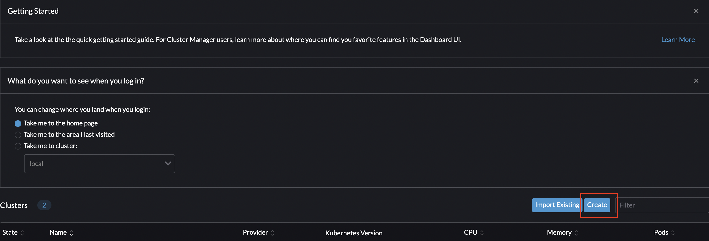
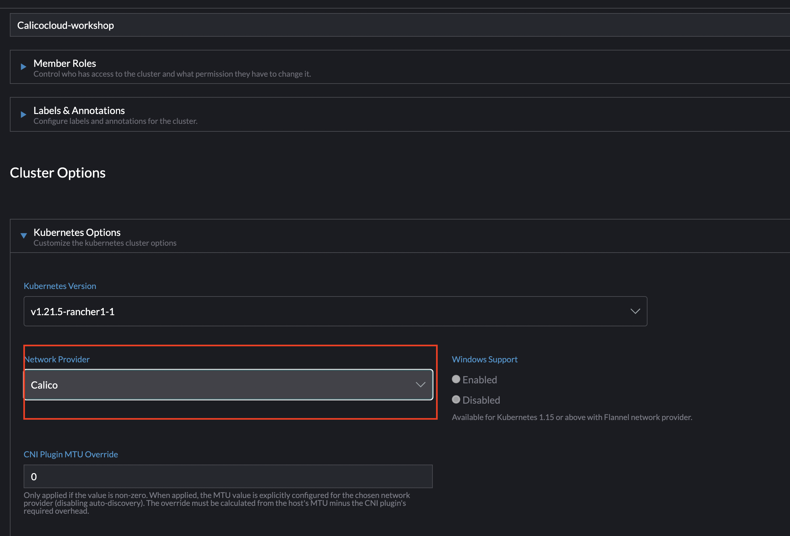
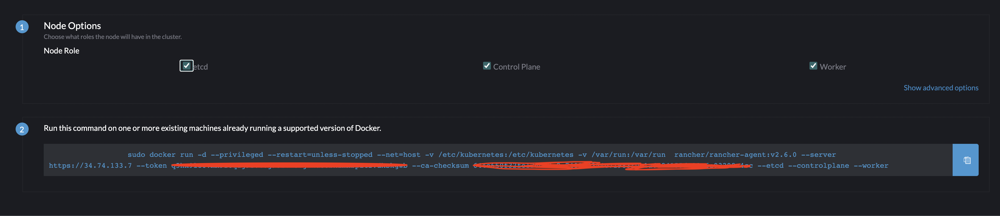
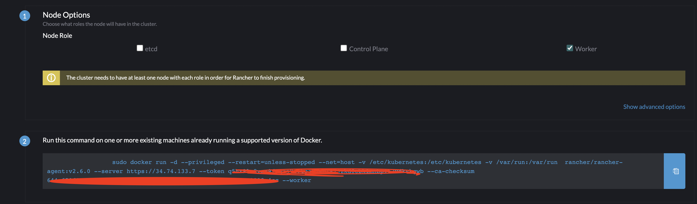
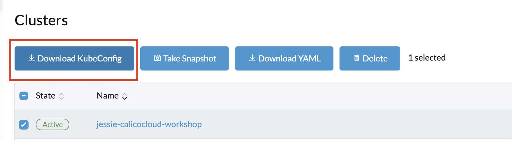

# Creating RKE cluster

The following guide is based upon the doc from [Rancher](https://rancher.com/docs/rke/latest/en/installation/).


**Goal:** Create RKE cluster.

> This workshop uses RKE cluster with Linux containers in GCP. 

## Prerequisite Tasks

- Have docker enabled in Linux server

- Start the Docker Runtime

  ```bash
  sudo systemctl start docker
  sudo /usr/sbin/usermod -aG docker $USER
  sudo chown $USER:docker /var/run/docker.sock
  ```

- Install Rancher Server 

  ```bash
  sudo docker run --privileged -d --restart=unless-stopped -p 80:80 -p 443:443 rancher/rancher
  ```

- Find the container ID

  ```bash
  docker ps
  ```
- Find the bootstrap password required for login:

  ```bash
  docker logs <container ID> 2>&1 | grep "Bootstrap Password:"
  ```
- Login your Rancher server with IP and password, for example: 

   https://<Rancher_Server_IP>/auth/login


## Steps

1. Provisioning compute instances. Refer to "creating kubeadm cluster" for provisioning VPC & subnet & firewalls
   ```bash
   gcloud compute instances create rancher-master \
    --async \
    --boot-disk-size 200GB \
    --can-ip-forward \
    --image-family ubuntu-2004-lts \
    --image-project ubuntu-os-cloud \
    --machine-type e2-standard-4 \
    --private-network-ip 10.240.0.222 \
    --scopes compute-rw,storage-ro,service-management,service-control,logging-write,monitoring \
    --subnet k8s-nodes \
    --zone us-east1-b \
    --tags calicocloud,rancher,master
    ```

   ```bash
   for i in 0 1; do
   gcloud compute instances create rancher-worker${i} \
    --async \
    --boot-disk-size 200GB \
    --can-ip-forward \
    --image-family ubuntu-2004-lts \
    --image-project ubuntu-os-cloud \
    --machine-type e2-standard-4 \
    --private-network-ip 10.240.0.22${i} \
    --scopes compute-rw,storage-ro,service-management,service-control,logging-write,monitoring \
    --subnet k8s-nodes \
    --zone us-east1-b \
    --tags calicocloud,rancher,worker
   done
   ```

2. Install Docker on each VM instances

   ```bash
   gcloud compute instances list --filter="tags.items=rancher"
   ```
   > Output as example with GCE instances.
   ```bash
   NAME             ZONE        MACHINE_TYPE   PREEMPTIBLE  INTERNAL_IP   EXTERNAL_IP    STATUS
   rancher-master   us-east1-b  e2-standard-4               10.240.0.222  <EXTERNAL_A>   RUNNING
   rancher-server   us-east1-b  e2-standard-4               10.240.0.111  <EXTERNAL_X>  RUNNING
   rancher-worker0  us-east1-b  e2-standard-4               10.240.0.220  <EXTERNAL_B>   RUNNING
   rancher-worker1  us-east1-b  e2-standard-4               10.240.0.221  <EXTERNAL_C>   RUNNING
   ```

   ```bash
   sudo su
   apt-get update
   apt-get install \
   apt-transport-https \
   ca-certificates \
   curl \
   gnupg \
   lsb-release -y
   ```

3. Add Docker’s official GPG key and install Docker Engine on each instances:
   
   ```bash
   curl -fsSL https://download.docker.com/linux/ubuntu/gpg | sudo gpg --dearmor -o /usr/share/keyrings/docker-archive-keyring.gpg
   ```

   ```bash
   echo \
   "deb [arch=amd64 signed-by=/usr/share/keyrings/docker-archive-keyring.gpg] https://download.docker.com/linux/ubuntu \
   $(lsb_release -cs) stable" | sudo tee /etc/apt/sources.list.d/docker.list > /dev/null
   ```


   ```bash
   sudo apt-get update
   sudo apt-get install docker-ce docker-ce-cli containerd.io -y
   ```

4. Go to Rancher UI, create a `custom` cluster with `calico` cni.

   

   

   

5. Rancher UI will generate a slightly different install script for control plane and workers, run these script in different nodes.

   a. For Master

   
   


   b. For Worker

   
   


6. Install kubectl binary with curl on Linux Rancher master :

   Download the latest release with the command:
   ```bash
   curl -LO "https://dl.k8s.io/release/$(curl -L -s https://dl.k8s.io/release/stable.txt)/bin/linux/amd64/kubectl"
   ```

   Install kubectl
   ```bash
   sudo install -o root -g root -m 0755 kubectl /usr/local/bin/kubectl
   ```

   If you do not have root access on the target system, you can still install kubectl to the ~/.local/bin directory:
   ```bash
   chmod +x kubectl
   mkdir -p ~/.local/bin/kubectl
   mv ./kubectl ~/.local/bin/kubectl
   # and then add ~/.local/bin/kubectl to $PATH
   ```

   Test to ensure the version you installed is up-to-date:
   ```bash
   kubectl version --client
   ```

7. Download the Kubeconfig file from Rancher UI

   

   Create a file in master node and paste the contents of the downloaded Kubeconfig.yaml manifest:

   ```bash
   vi kubeconfig.yaml
   ```

   ```bash

   echo export KUBECONFIG=kubeconfig.yaml >> ~/.bashrc

   ```

   You should now be able to see your 3 nodes (if the docker install command was used on each EC2 instance):
   ```bash
   kubectl get nodes
   ```

   >output 

   ```bash
   NAME              STATUS   ROLES                      AGE   VERSION
   rancher-master    Ready    controlplane,etcd,worker   21m   v1.21.5
   rancher-worker0   Ready    worker                     19m   v1.21.5
   rancher-worker1   Ready    worker                     18m   v1.21.5
   ```


--- 
## Next steps

You should now have a Kubernetes cluster RKE running with 3 nodes. The Control Plane services which manage the Kubernetes cluster such as scheduling, API access, configuration data store and object controllers are all provided as services to the nodes.
<br>    


[Next ->Joining cluster to Calico Cloud](../modules/joining-calico-cloud.md)

[Menu](../README.md)