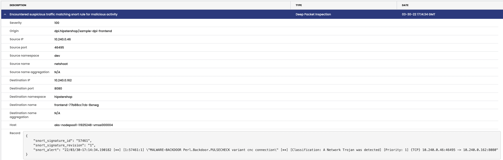

# Deep packet inspection 


**Goal:** Use DPI on select workloads to efficiently make use of cluster resources and minimize the impact of false positives. 

>For each deep packet inspection resource (DeepPacketInspection), CalicoCloud creates a live network monitor that inspects the header and payload information of packets that match the [Snort community rules](https://www.snort.org/downloads/#rule-downloads). Whenever malicious activities are suspected, an alert is automatically added to the Alerts page in the Calico Manager UI.


## Steps

 1. Configure deep packet inspection in your target workload, we will use `hipstershop/frontend` as example.

   ```bash
   kubectl apply -f demo/dpi/sample-dpi-frontend.yaml
   ```  
   

 2. Configure resource requirements in IntrusionDetection.

  > For a data transfer rate of 1GB/sec on workload endpoints being monitored, we recommend a minimum of 1 CPU and 1GB RAM.
   
   ```bash
   kubectl apply -f demo/dpi/resource-dpi.yaml
   ```

 3. Verify deep packet inspection is running and the daemonset of `tigera-dpi` is also running. 

   ```bash
   kubectl get deeppacketinspections -n hipstershop
   ```

   ```bash
   kubectl get pods -n tigera-dpi
   ```
   
   ```text
   NAME               READY   STATUS    RESTARTS   AGE
   tigera-dpi-66858   1/1     Running   0          3h58m
   tigera-dpi-x67sj   1/1     Running   0          3h58m
   ```

 4. Trigger a snort alert basing on existing alert rules, we will use rule [57461](https://www.snort.org/rule_docs/1-57461)    

   ```bash
   SVC_IP=$(kubectl -n hipstershop get svc frontend-external -ojsonpath='{.status.loadBalancer.ingress[0].ip}')
  
   # use below command if you are using `EKS` cluster, as EKS is using hostname instead of ip for loadbalancer
   SVC_IP=$(kubectl -n hipstershop get svc frontend-external -ojsonpath='{.status.loadBalancer.ingress[0].hostname}')
   ```

   For RKE/kubeadm clusters, your `frontend-external` lb will be in <pending> mode, you can either test within cluster, or add external ip or use ingress controller to expose this svc. 
   ```bash
   #add external IP for your svc 
   kubectl edit -n hipstershop svc frontend-external
   ```

   ```text
   spec:
     clusterIP: 10.43.111.144
     clusterIPs:
     - 10.43.111.144
     externalIPs:    ## Add this line for your service
     - 34.xxx.xxx.88 ## Add your node public ip which have frontend pod running as endpoint for this value

   ```
   
   ```text 
   NAME                TYPE           CLUSTER-IP      EXTERNAL-IP     PORT(S)        AGE
   frontend-external   LoadBalancer   10.43.111.144   34.xxx.xxx.88   80:31209/TCP   5h52m
   ```

   > A workaround for DPI alert not able to generate in UI as in policy `allow-tigera.guardian-access` block dpi alert to ES. We will update this policy with `allow tcp` in ingress before curl. 
   ```bash
   #curl frontend service within cluster
   kubectl -n dev exec -t netshoot -- sh -c "curl http://frontend.hipstershop/secid_canceltoken.cgi -H 'X-CMD: Test' -H 'X-KEY: Test' -XPOST"
   ```

   ```bash
   #curl your loadbalancer from outside of cluster
   curl http://$SVC_IP:80/secid_canceltoken.cgi -H 'X-CMD: Test' -H 'X-KEY: Test' -XPOST
   ```

   ```bash
   #curl your external ip with Nodeport from outside of cluster
   curl http://34.xxx.xxx.88:31209/secid_canceltoken.cgi -H 'X-CMD: Test' -H 'X-KEY: Test' -XPOST
   ```

 5. Confirm the `Signature Triggered Alert` in manager UI and also in Kibana `ee_event`
    


    


---

[:arrow_right: Compliance reports](./compliance-reports.md) 

[:leftwards_arrow_with_hook: Back to README.md](../README.md)