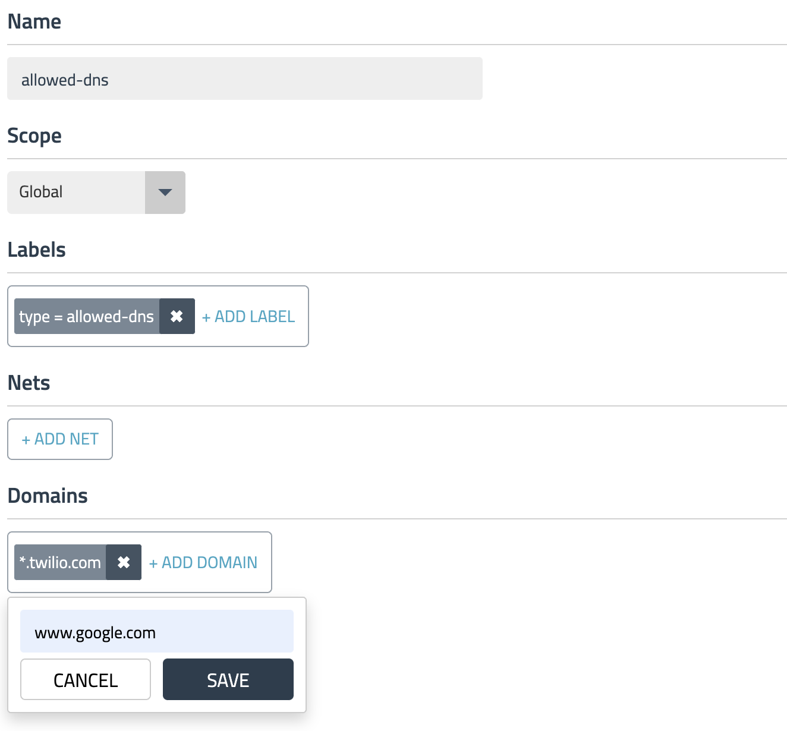

# North-South Controls: DNS Egress Controls

**Goal:** Configure egress access control for specific workloads so they are allow to external DNS domain.

## Steps

1. Implement DNS policy to allow the external endpoint access from a specific workload, e.g. `dev/centos`.

    a. Apply a policy to allow access to `api.twilio.com` endpoint using DNS rule.

    ```bash
    # deploy dns policy
    kubectl apply -f demo/egress-access-controls/dns-policy.yaml

    # test egress access to api.twilio.com
    kubectl -n dev exec -t centos -- sh -c 'curl -m3 -skI https://api.twilio.com 2>/dev/null | grep -i http'
    # test egress access to www.google.com
    kubectl -n dev exec -t centos -- sh -c 'curl -m3 -skI https://www.google.com 2>/dev/null | grep -i http'
    ```

    Access to the `api.twilio.com` endpoint should be allowed by the DNS policy and any other external endpoints like `www.google.com` should be denied. 

    b. Modify the policy to include `www.google.com` in dns policy and test egress access to www.google.com again.

    ```bash
    # test egress access to www.google.com again and it should be allowed.
    kubectl -n dev exec -t centos -- sh -c 'curl -m3 -skI https://www.google.com 2>/dev/null | grep -i http'
    ```


2.  Edit the policy to use a `NetworkSet` with DNS domain instead of inline DNS rule.

    a. Apply a policy to allow access to `api.twilio.com` endpoint using DNS policy.

    ```bash
    # deploy network set
    kubectl apply -f demo/egress-access-controls/netset.external-apis.yaml
    # deploy DNS policy using the network set
    kubectl apply -f demo/egress-access-controls/dns-policy.netset.yaml


    # test egress access to api.twilio.com
    kubectl -n dev exec -t centos -- sh -c 'curl -m3 -skI https://api.twilio.com 2>/dev/null | grep -i http'
    # test egress access to www.google.com
    kubectl -n dev exec -t centos -- sh -c 'curl -m3 -skI https://www.google.com 2>/dev/null | grep -i http'
    ```
    
    b. Modify the `NetworkSet` to include `www.google.com` in dns domain and test egress access to www.google.com again.

     

    ```bash
    # test egress access to www.google.com again and it should be allowed.
    kubectl -n dev exec -t centos -- sh -c 'curl -m3 -skI https://www.google.com 2>/dev/null | grep -i http'
    ```
    

[Next -> Global threadfeed](modules/global-threadfeed.md)

[Menu](../README.md)