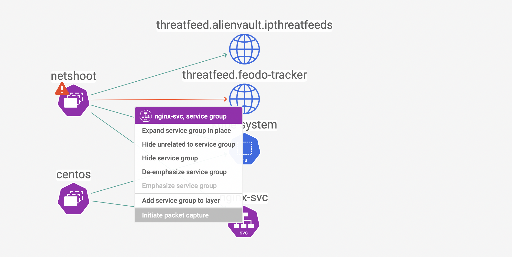
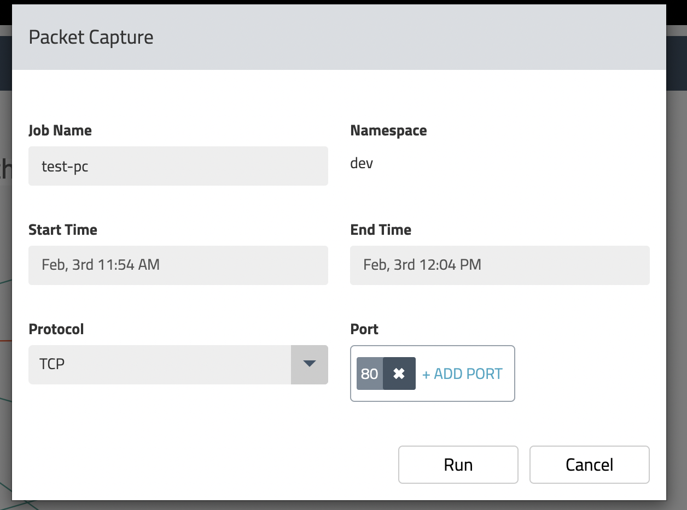
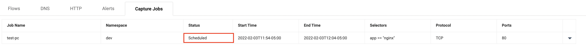
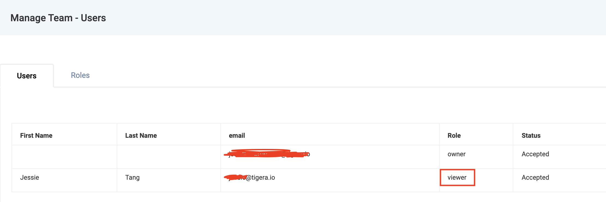
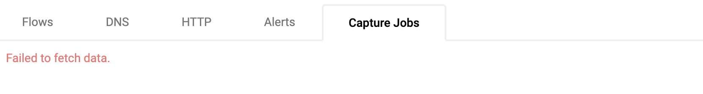

# Dynamic packet capture

**Goal:** Configure packet capture for specific pods and review captured payload. 

Calico enterprise/cloud provide enhanced packet capture feature for DevOps troubleshooting. Packet captures are Kubernetes Custom Resources and thus native Kubernetes RBAC can be used to control which users/groups can run and access Packet Captures; this may be useful if Compliance or Governance policies mandate strict controls on running Packet Captures for specific workloads. This demo is simplified without RBAC but further details can be found [here](https://docs.tigera.io/v3.10/visibility/packetcapture).

# Steps

## step 1. Capture all packet for nginx pods.

 1. Initial packet capture job from manager UI. 

  

 2. Schedule the packet capture job with specific port.

  

 3. You will see the job scheduled in service graph.

  

 4. Download the pcap file once the job is `Capturing` or `Finished`. 
   
  
   

 

## *[Bonus]* Calicocloud provide different RBAC role for packet capture resource. 

 > Calicocloud provide pre-defined role in `manage team - user` which `viwer` doesn't have permissions to `get/list` Packet Capture resource. 

 1. Add one of your team members in this calicocloud management plane. 

  

 2. Confirm they accept your invite. 
  
  

 3. Use their email address to login calicocloud UI and confirm they cannot fetch or create any packet capture jobs.
  
  

---

[:arrow_right: Global ThreatFeeds](./global-threatfeed.md)

[:leftwards_arrow_with_hook: Back to README.md](../README.md)