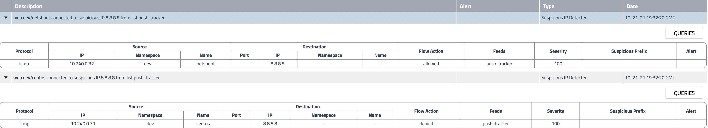

# North-South Controls: Global Threadfeed

**Goal:** Configure egress access control for outside threadfeed policy so workloads within cluster are not allow to external networkset

## Steps

1. Protect workloads with GlobalThreatfeed from known bad actors.

    Calicocloud offers [Global threat feed](https://docs.tigera.io/reference/resources/globalthreatfeed) resource to prevent known bad actors from accessing Kubernetes pods.

    ```bash
    kubectl get globalthreatfeeds
    ```

    >Output is 
    ```bash
    NAME                           CREATED AT
    alienvault.domainthreatfeeds   2021-09-28T15:01:33Z
    alienvault.ipthreatfeeds       2021-09-28T15:01:33Z
    ```

    You can get these domain/ip list from yaml file, the url would be:

    ```bash
    kubectl get globalthreatfeeds alienvault.domainthreatfeeds -ojson | jq -r '.spec.pull.http.url'

    kubectl get globalthreatfeeds alienvault.ipthreatfeeds -ojson | jq -r '.spec.pull.http.url'
    ```

    >Output is 
    ```bash
    https://installer.calicocloud.io/feeds/v1/domains

    https://installer.calicocloud.io/feeds/v1/ips
    ```


    ```bash
    # deploy feodo and snort threatfeeds
    kubectl apply -f demo/threatfeeds/feodo-tracker.yaml
    kubectl apply -f demo/threatfeeds/feodo-block-policy.yaml

    # Confirm and check the tracker threatfeed
    kubectl get globalthreatfeeds 

    ```

    ```bash
    NAME                           CREATED AT
    alienvault.domainthreatfeeds   2021-09-28T15:01:33Z
    alienvault.ipthreatfeeds       2021-09-28T15:01:33Z
    feodo-tracker                  2021-09-28T17:32:13Z
    ```
    
2. Generate alerts by accessing the IP from `feodo-tracker` list. 

    ```bash
    # try to ping any of the IPs in from the feodo tracker list.
    FIP=$(kubectl get globalnetworkset threatfeed.feodo-tracker -ojson | jq -r '.spec.nets[0]' | sed -e 's/^"//' -e 's/"$//' -e 's/\/32//')
    kubectl -n dev exec -t netshoot -- sh -c "ping -c1 $FIP"
    ```

3. Add more threatfeeds into networkset and prevent your cluster from them.

    ```bash
    # deploy embargo and other threatfeeds
    kubectl apply -f demo/threatfeeds/embargo.networkset.yaml
    kubectl apply -f demo/threatfeeds/security.embargo-countries.yaml
    
    ```
    
### *[Bonus]* push a threatfeed to your managed cluster and generate an alert with these ip list.    

  1. Create a push threatfeed in your cluster. 

     ```bash
     kubectl apply -f - <<EOF
     apiVersion: projectcalico.org/v3
     kind: GlobalThreatFeed
     metadata:
       name: push-tracker
     spec:
       content: IPSet
     EOF
     ```

   2. Push the ipset from your ES dev tool with `put` verb, use the correct cluster name as index. It should be same as your `CALICOCLUSTERNAME`
   
    > Use 99/32, 100/24, and 8/32 as example below.

     ```text
     PUT .tigera.ipset.<cluster_name>/_doc/push-tracker
     {
     "ips" : ["99.99.99.99/32", "100.100.100.0/24", "8.8.8.8/32"]
     }
     ```

    > Output is similar as 
     ```text
     "result" : "created",
     "_shards" : {
     "total" : 2,
     "successful" : 2,
     "failed" : 0
     }
     ```

   3. Generate an alert by ping the ip
     ```bash
     kubectl -n dev exec -t netshoot -- sh -c 'ping -c1 8.8.8.8'
     kubectl -n dev exec -t centos -- sh -c 'ping -c1 8.8.8.8'
     ```

   4. Confirm you are able to see the aler in alert list. The netshoot flow show `allow` as no policy in place for `netshoot` pod, and centos flow show `denied` as we have deny policy for `centos` egress traffic.
   
     
        

[Next -> Manager UI](../modules/manager-ui.md)

[Menu](../README.md)