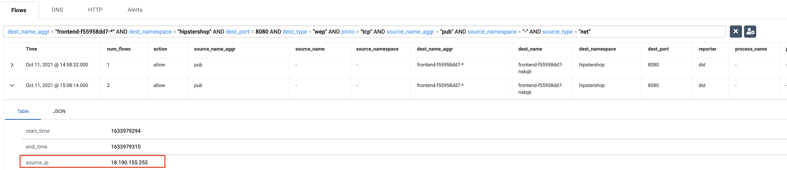
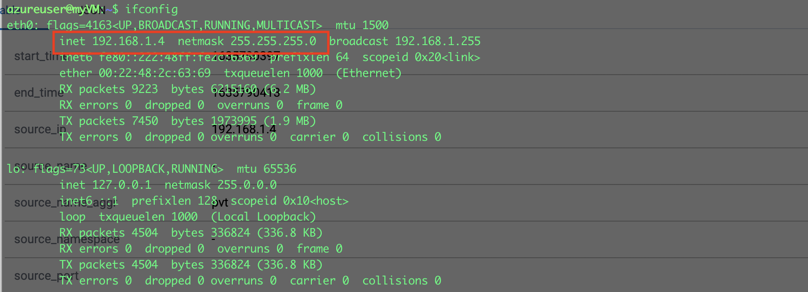
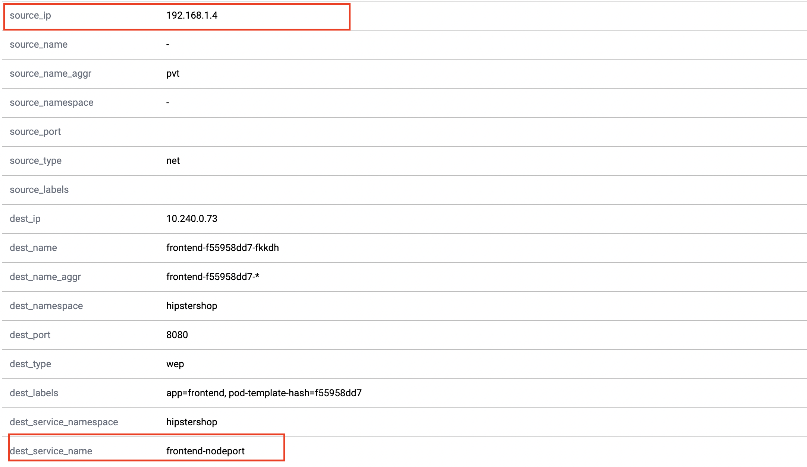

# Security: Host protection

**Goal:** Secure hosts ports with network policies.

Calico network policies not only can secure pod to pod communications but also can be applied to Kubernetes hosts to protect host based services and ports. For more details refer to [Protect Kubernetes nodes](https://docs.tigera.io/security/kubernetes-nodes) documentaiton.

## Steps


### For EKS cluster 

1. Enable automatic host endpoints
   ```bash
   # check whether auto-creation for HEPs is enabled. Default: Disabled
   kubectl get kubecontrollersconfiguration.p default -ojsonpath='{.status.runningConfig.controllers.node.hostEndpoint.autoCreate}'
   ```

   ```bash
   kubectl patch kubecontrollersconfiguration default --patch='{"spec": {"controllers": {"node": {"hostEndpoint": {"autoCreate": "Enabled"}}}}}'

   ```

   ```bash
   kubectl get heps -o wide
   ```
   >Output is similar as 

   ```bash
   NAME                                                    CREATED AT
   ip-192-168-28-80.us-east-2.compute.internal-auto-hep    2021-10-11T17:11:08Z
   ip-192-168-60-203.us-east-2.compute.internal-auto-hep   2021-10-11T17:11:08Z
   ip-192-168-86-192.us-east-2.compute.internal-auto-hep   2021-10-11T17:11:09Z
   ```

2. Enable automatic host endpoints flow logs.   
   
   ```bash
   kubectl patch felixconfiguration default -p '{"spec":{"flowLogsEnableHostEndpoint":true}}'
   ```  

3.  Expose the frontend service via the NodePort service type, we use `30080` port as example.
   ```bash
    kubectl -n hipstershop expose deployment frontend --type=NodePort --name=frontend-nodeport --overrides='{"apiVersion":"v1","spec":{"ports":[{"nodePort":30080,"port":80,"targetPort":8080}]}}'
   ```

4. Get public IP of node and test the exposed port of `30080` from your shell.
   ```bash
   PUB_IP=$(kubectl get nodes --selector=kubernetes.io/role!=master -o jsonpath={.items[*].status.addresses[?\(@.type==\"ExternalIP\"\)].address} | awk '{ print $1 }')
   ```

5. Label the node for HEP testing.
   ```bash
   NODE_NAME=$(kubectl get nodes -o wide | grep $PUB_IP | awk '{print $1}')

   kubectl label nodes $NODE_NAME  host-end-point=test
   ```

6. Open a port of NodePort service for public access on EKS node.

    ```bash
    # open access to the port in AWS security group
    EKS_CLUSTER='calicocloud-workshop' # adjust the name if you used a different name for your EKS cluster
    AWS_REGION=$(curl -s 169.254.169.254/latest/dynamic/instance-identity/document | jq -r '.region')
    # pick one EKS node and use it's ID to get securigy group
    SG_ID=$(aws ec2 describe-instances --region $AWS_REGION --filters "Name=tag:Name,Values=$EKS_CLUSTER*" "Name=instance-state-name,Values=running" --query 'Reservations[0].Instances[*].NetworkInterfaces[0].Groups[0].GroupId' --output text --output text)

    # open 30080 port in the security group for public access
    aws ec2 authorize-security-group-ingress --region $AWS_REGION --group-id $SG_ID --protocol tcp --port 30080 --cidr 0.0.0.0/0
    ```

    >It can take a moment for the node port to become accessible.

    If the frontend service port was configured correctly, the `nc` command should show you that the port is open.
    ```bash
    #test connection to frontend 30080 port from your local shell, the expected result is 30080 open. 
    nc -zv $PUB_IP 30080
    ```

7. Implement a Calico policy to control access to the service of NodePort type, which only allow `VM_IP` with port `30080` to frontend service.

    get public IP of Cloud9 instance in the Cloud9 shell
    ```bash
    VM_IP=$(curl -s http://169.254.169.254/latest/meta-data/public-ipv4)
    
    # deploy HEP policy
    sed -i "s/\${VM_IP}/${VM_IP}\/32/g" ./demo/host-end-point/frontend-nodeport-allow.yaml

    #For other variations/shells the following syntax may be required
    sed -i "" "s/\${VM_IP}/${VM_IP}\/32/g" ./demo/host-end-point/frontend-nodeport-allow.yaml

    kubectl apply -f demo/host-end-point/frontend-nodeport-allow.yaml
    
    # test access from Cloud9 shell, the expected result is 30080 open
    nc -zv $PUB_IP 30080 

    # test access from local shell, the expected result is 30080 Operation timed out
    nc -zv $PUB_IP 30080 
    ```

8. Confirm you are able to see the `VM_IP` as source IP and the host name in your flow log.

   


### For AKS cluster 

1. Create a VM instance in your resource group. You can customize your vm by follow this [doc](https://docs.microsoft.com/en-us/azure/virtual-machines/linux/create-cli-complete)
   ```bash
   az network vnet create -g $RGNAME -n MyVnet --address-prefix 192.168.0.0/16 --subnet-name MySubnet --subnet-prefix 192.168.1.0/24 --location eastus
   az network public-ip create -g $RGNAME  -n myPublicIP  --location eastus 
   az network nsg create -g $RGNAME --name myNetworkSecurityGroup
   az network nsg rule create -g $RGNAME --nsg-name myNetworkSecurityGroup --name AllowRuleSSH --protocol tcp --priority 1000 --destination-port-range 22 --access allow
   az network nic create -g $RGNAME --name myNic --vnet-name myVnet --subnet mySubnet --public-ip-address myPublicIP --network-security-group myNetworkSecurityGroup
   az vm create -g $RGNAME --name myVM --location eastus --nics myNic --image UbuntuLTS --admin-username azureuser --generate-ssh-keys
   VM_IP=$(az network public-ip show -g $RGNAME -n myPublicIP --query ipAddress -o tsv)

   ```
   
   ```bash
   #You should be able ssh to your vm with public IP
   ssh -i /.ssh/id_rsa azureuser@$VM_IP
   ```

2. Peer your vm vnet with aks cluster vnet. You can customize your vm by follow this [doc](https://docs.microsoft.com/en-us/azure/virtual-network/tutorial-connect-virtual-networks-cli)


   ```bash
   #vNet1Id is your vnet id for aks cluster, vNet2Id is your vnet for VM.
   CLUSTER_RESOURCE_GROUP=$(az aks show -g $RGNAME --n $CLUSTERNAME --query nodeResourceGroup -o tsv)
   VNET=$(az network vnet list -g $CLUSTER_RESOURCE_GROUP -o tsv --query '[0].name') 
   vNet1Id=$(az network vnet show -g $CLUSTER_RESOURCE_GROUP -n $VNET --query id --out tsv) 
   vNet2Id=$(az network vnet show -g $RGNAME -n myVnet --query id --out tsv) 
   ```
   
   ```bash
   #Create vnet1 to vnet2 peering and vnet2 to vnet1 peering 
   az network vnet peering create -g $CLUSTER_RESOURCE_GROUP --name vnet1vnet2peer --vnet-name $VNET --remote-vnet-id $vNet2Id --allow-vnet-access
   az network vnet peering create -g $RGNAME --name vnet2vnet1peer --vnet-name myVnet --remote-vnet-id $vNet1Id --allow-vnet-access
   az network vnet peering show --name vnet1vnet2peer -g $CLUSTER_RESOURCE_GROUP --vnet-name $VNET --query peeringState
   az network vnet peering show --name vnet2vnet1peer -g $RGNAME --vnet-name myVnet --query peeringState
   ```

3. Enable automatic host endpoints in your AKS cluster
   ```bash
   # check whether auto-creation for HEPs is enabled. Default: Disabled
   kubectl get kubecontrollersconfiguration.p default -ojsonpath='{.status.runningConfig.controllers.node.hostEndpoint.autoCreate}'
   ```

   ```bash
   kubectl patch kubecontrollersconfiguration default --patch='{"spec": {"controllers": {"node": {"hostEndpoint": {"autoCreate": "Enabled"}}}}}'

   ```

   ```bash
   kubectl get heps -o wide
   ```
   >Output is similar as 

   ```bash
   NAME                                                    CREATED AT
   aks-nodepool1-xxxx-vmss000000-auto-hep   2021-10-28T16:39:53Z
   aks-nodepool1-xxxx-vmss000001-auto-hep   2021-10-28T16:39:53Z
   aks-nodepool1-xxxx-vmss000002-auto-hep   2021-10-28T16:39:53Z   
   ```

4. Enable automatic host endpoints flow logs.   
   
   ```bash
   kubectl patch felixconfiguration default -p '{"spec":{"flowLogsEnableHostEndpoint":true}}'
   ```  

5.  Expose the frontend service via the NodePort service type, we use `30080` port as example.
   ```bash
    kubectl -n hipstershop expose deployment frontend --type=NodePort --name=frontend-nodeport --overrides='{"apiVersion":"v1","spec":{"ports":[{"nodePort":30080,"port":80,"targetPort":8080}]}}'
   ```

6. Get internal IP of node and test the exposed port of `30080` from your vm.
   ```bash
   JPIP='{range .items[*]}{@.status.addresses[?(@.type == "InternalIP")].address}{"\n"}{end}'
   NODE_IP1=$(kubectl get nodes --output jsonpath="$JPIP" | awk 'NR==1{print $1 }')
   NODE_IP2=$(kubectl get nodes --output jsonpath="$JPIP" | awk 'NR==2{print $1 }')
   echo $NODE_IP1
   echo $NODE_IP2
   ```

   ssh to your vm from local shell and test the NodePort `30080`, the expecting result would be 'Connection to 10.240.0.4 30080 port [tcp/*] succeeded!'
   ```bash
   ssh -i /.ssh/id_rsa azureuser@$VM_IP
   sudo apt-get install netcat
   nc -zv $NODE_IP1 30080
   nc -zv $NODE_IP2 30080
   exit
   ```

7. Label the node for HEP testing.
   ```bash
   JPNAME='{range .items[*]}{@.metadata.name}{"\t"}{@.status.addresses[?(@.type == "InternalIP")].address}{"\n"}{end}'
   NODE_NAME1=$(kubectl get nodes --output jsonpath="$JPNAME" | awk 'NR==1{print $1 }')
   NODE_NAME2=$(kubectl get nodes --output jsonpath="$JPNAME" | awk 'NR==2{print $1 }')
   kubectl label nodes $NODE_NAME1 host-end-point=test
   ```

8. Implement a Calico policy to control access to the service of NodePort type, which will deny `VM` with port `30080` to frontend service.

    get private IP of vm instance. 
    ```bash
    PRV_IP=$(az vm show -g $RGNAME -n myVM --query privateIps -d --out tsv)
    
    # deploy HEP policy
    sed -i "s/\${PRV_IP}/${PRV_IP}\/32/g" ./demo/host-end-point/frontend-nodeport-deny.yaml

    #For other variations/shells the following syntax may be required
    sed -i "" "s/\${PRV_IP}/${PRV_IP}\/32/g" ./demo/host-end-point/frontend-nodeport-deny.yaml

    kubectl apply -f demo/host-end-point/frontend-nodeport-deny.yaml
    
    # test access from vm shell, the expected result is 30080 Operation timed out
    nc -zv $NODE_IP1 30080 

    # test access from vm shell to other nodes, the expected result will be 30080 open
    nc -zv $NODE_IP2 30080 
    ```

9. Confirm you are able to see the `VM_IP` as source IP and the host name in your flow log.

   

   


### *[Bonus]* Leverage networkset to control ingress traffic for your k8s node. 

   1. Create a networkset with your VM_IP cidr from UI. 

   
   
   2. Update your host endpoints policy with networkset label as source. 

   

   3. You should be able to see the flow logs when you netshoot again from your VM. 

   


### For GEK cluster

### For Kubeadm cluster

### For RKE cluster 

### 

[Next -> eBPF dataplane](../modules/ebpf-dataplane.md)

[Menu](../README.md)