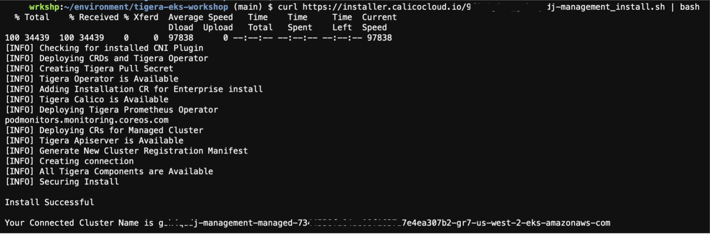
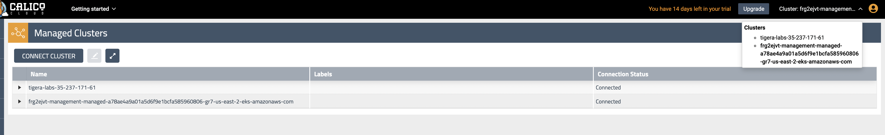

# Joining your cluster to Calico Cloud

**Goal:** Join cluster to Calico Cloud management plane.

IMPORTANT: In order to complete this module, you must have [Calico Cloud trial account](https://www.calicocloud.io/home). Issues with being unable to navigate menus in the UI are often due to browsers blocking scripts - please ensure you disable any script blockers.

## Steps

1. Navigate to [https://www.calicocloud.io/home](https://www.calicocloud.io/home) and sign up for a 14 day trial account - no credit cards required. Returning users can login.

   

2. Upon signing into the Calico Cloud UI the Welcome screen shows four use cases which will give a quick tour for learning more. This step can be skipped. Tip: the menu icons on the left can be expanded to display the worded menu as shown:

   


3. Join your cluster to Calico Cloud management plane.
    
    Click the "Managed Cluster" in your left side of browser.
    
    
    Click on "connect cluster"
     

    choose your and click next, use aks as example
      


    run installation script in your cluster. 
    ```bash
    # script should look similar to this
    curl https://installer.calicocloud.io/xxxxxx_yyyyyyy-saay-management_install.sh | bash
    ```

    Joining the cluster to Calico Cloud can take a few minutes. Wait for the installation script to finish before you proceed to the next step.

    You should see the output similar to this:

     

    Set the Calico Cluster Name as a variable to use later in this workshop. The Cluster Name can also be obtained from the Calico Cloud Web UI at a later date. For the example above `CALICOCLUSTERNAME` should be set to __######-management-managed-#####__
    
    ```bash
    export CALICOCLUSTERNAME=<Cluster Name>

    #For Linux terminal
    echo export CALICOCLUSTERNAME=$CALICOCLUSTERNAME | tee -a ~/.bash_profile

    #For Mac terminal
    echo export CALICOCLUSTERNAME=$CALICOCLUSTERNAME | tee -a ~/.zshrc 
    ```
    
    Set the Elastic Index Name as a variable to use later in this workshop. The Index Name can also be obtained from `intrusion-detection-controller` or `compliance-controller` deployment. For example below, the `ELASTIC_INDEX_SUFFIX` should be set to __pkgr91xc.#####-management-managed-#####__
    
    ```bash
    kubectl describe deployment -n tigera-intrusion-detection   intrusion-detection-controller | grep ELASTIC_INDEX_SUFFIX
    ```
    >Output is  
    ```text
    ELASTIC_INDEX_SUFFIX:     pkgr91xc.#####-management-managed-eastus-####
    ```

    ```bash
    export ELASTIC_INDEX_SUFFIX=<Index Name>  
    
    #For Linux terminal
    echo export ELASTIC_INDEX_SUFFIX=$ELASTIC_INDEX_SUFFIX | tee -a ~/.bash_profile

    #For Mac terminal
    echo export ELASTIC_INDEX_SUFFIX=$ELASTIC_INDEX_SUFFIX | tee -a ~/.zshrc 
    ```

    In calico cloud management UI, you can see your own cluster added in "managed cluster", you can also confirm by
    ```bash
    kubectl get tigerastatus
    ```
    
    ```bash
    #make sure all customer resources are "AVAILABLE=True" 
    NAME                            AVAILABLE   PROGRESSING   DEGRADED   SINCE
    apiserver                       True        False         False      5m38s
    calico                          True        False         False      4m44s
    compliance                      True        False         False      4m34s
    intrusion-detection             True        False         False      4m49s
    log-collector                   True        False         False      4m19s
    management-cluster-connection   True        False         False      4m54s
    ```
    
4. Navigating the Calico Cloud UI

    Once the cluster has successfully connected to Calico Cloud you can review the cluster status in the UI. Click on `Managed Clusters` from the left side menu and look for the `connected` status of your cluster. You will also see a `Tigera-labs` cluster for demo purposes. Ensure you are in the correct cluster context by clicking the `Cluster` dropdown in the top right corner. This will list the connected clusters. Click on your cluster to switch context otherwise the current cluster context is in *bold* font.
    
    

5. Configure log aggregation and flush intervals, we will use 15s instead of default value 300s for lab testing only.   

    ```bash
    kubectl patch felixconfiguration.p default -p '{"spec":{"flowLogsFlushInterval":"15s"}}'
    kubectl patch felixconfiguration.p default -p '{"spec":{"dnsLogsFlushInterval":"15s"}}'
    kubectl patch felixconfiguration.p default -p '{"spec":{"flowLogsFileAggregationKindForAllowed":1}}'
    ```

   > If you hit an error message of "iptablesBackend cannot be auto" for your RKE, use command below to remove this Field and value in spec.

    ```bash
    kubectl edit felixconfigurations default
    ```

6. Configure Felix to collect TCP stats - this uses eBPF TC program and requires miniumum Kernel version of v5.3.0. Further [documentation](https://docs.tigera.io/visibility/elastic/flow/tcpstats)

   >Calico Cloud/Enterprise can collect additional TCP socket statistics. While this feature is available in both iptables and eBPF dataplane modes, it uses eBPF to collect the statistics. Therefore it requires a recent Linux kernel (at least v5.3.0/v4.18.0-193 for RHEL).

    ```bash
    kubectl patch felixconfiguration default -p '{"spec":{"flowLogsCollectTcpStats":true}}'
    ```

    


[Next -> Configuring demo applications](../modules/configuring-demo-apps.md)

[Menu](../README.md)