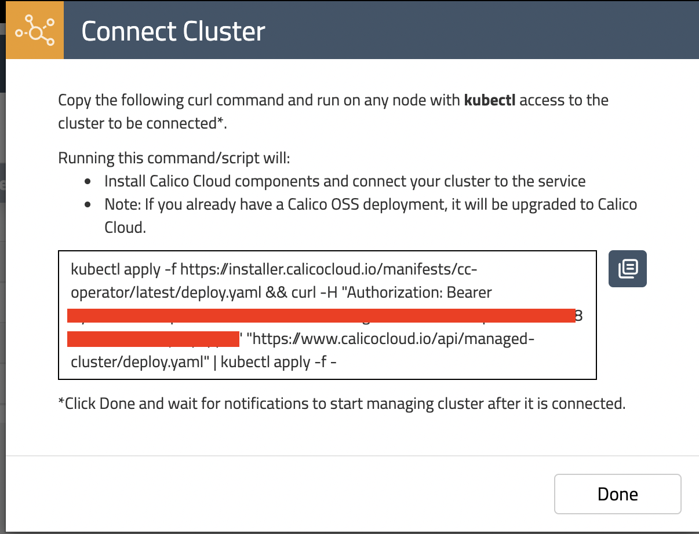
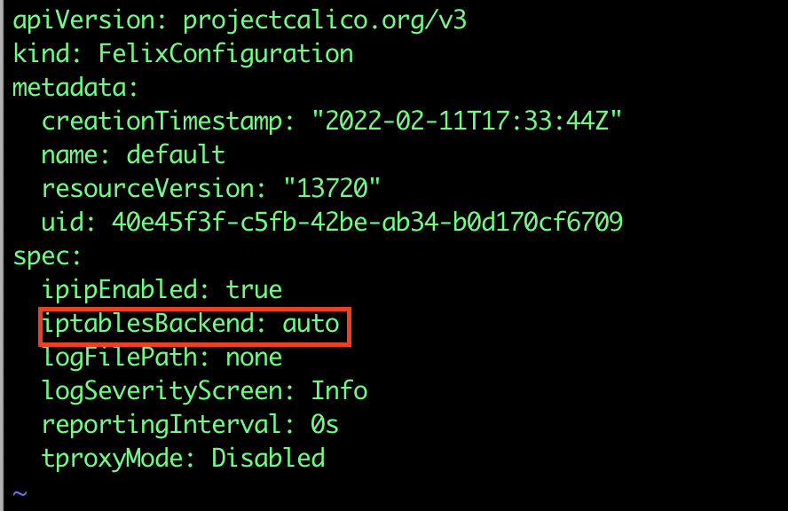

# Joining your cluster to Calico Cloud

**Goal:** Join cluster to Calico Cloud management plane.

IMPORTANT: In order to complete this module, you must have [Calico Cloud trial account](https://www.calicocloud.io/). Issues with being unable to navigate menus in the UI are often due to browsers blocking scripts - please ensure you disable any script blockers.

## Steps

1. Navigate to [https://www.calicocloud.io/](https://www.calicocloud.io/) and sign up for a 14 day trial account - no credit cards required. Returning users can login.

   

2. You will receive a confirmation e-mail.

   

2. Upon signing into the Calico Cloud UI the Welcome screen shows four use cases which will give a quick tour for learning more. This step can be skipped. Tip: the menu icons on the left can be expanded to display the worded menu as shown:


   


3. Join your cluster to Calico Cloud management plane.
    
    Click the "Managed Cluster" in your left side of browser.
    
    
    Click on "connect cluster"
     

    choose your and click next, use aks as example
      


    Run installation script in your aks cluster. Script should look similar to this:
      


    > Output should look similar to:
    ```bash
    namespace/calico-cloud created
    customresourcedefinition.apiextensions.k8s.io/installers.operator.calicocloud.io created
    serviceaccount/calico-cloud-controller-manager created
    role.rbac.authorization.k8s.io/calico-cloud-leader-election-role created
    clusterrole.rbac.authorization.k8s.io/calico-cloud-metrics-reader created
    clusterrole.rbac.authorization.k8s.io/calico-cloud-proxy-role created
    rolebinding.rbac.authorization.k8s.io/calico-cloud-leader-election-rolebinding created
    clusterrolebinding.rbac.authorization.k8s.io/calico-cloud-installer-rbac created
    clusterrolebinding.rbac.authorization.k8s.io/calico-cloud-proxy-rolebinding created
    configmap/calico-cloud-manager-config created
    service/calico-cloud-controller-manager-metrics-service created
    deployment.apps/calico-cloud-controller-manager created
    % Total    % Received % Xferd  Average Speed   Time    Time     Time  Current
                                    Dload  Upload   Total   Spent    Left  Speed
    100   355  100   355    0     0    541      0 --:--:-- --:--:-- --:--:--   541
    secret/api-key created
    installer.operator.calicocloud.io/aks-cc-repo created
    ```
    Joining the cluster to Calico Cloud can take a few minutes. Meanwhile the Calico resources can be monitored until they are all reporting `Available` as `True`

    ```bash
    kubectl get tigerastatus                                                                                                                    

    NAME                            AVAILABLE   PROGRESSING   DEGRADED   SINCE
    apiserver                       True        False         False      96s
    calico                          True        False         False      16s
    compliance                      True        False         False      21s
    intrusion-detection             True        False         False      41s
    log-collector                   True        False         False      21s
    management-cluster-connection   True        False         False      51s
    monitor                         True        False         False      2m1s
    ```
    
4. Navigating the Calico Cloud UI

    Once the cluster has successfully connected to Calico Cloud you can review the cluster status in the UI. Click on `Managed Clusters` from the left side menu and look for the `connected` status of your cluster. You will also see a `Tigera-labs` cluster for demo purposes. Ensure you are in the correct cluster context by clicking the `Cluster` dropdown in the top right corner. This will list the connected clusters. Click on your cluster to switch context otherwise the current cluster context is in *bold* font.
    
    

5. Configure log aggregation and flush intervals in aks cluster, we will use 10s instead of default value 300s for lab testing only.   

    ```bash
    kubectl patch felixconfiguration.p default -p '{"spec":{"flowLogsFlushInterval":"10s"}}'
    kubectl patch felixconfiguration.p default -p '{"spec":{"dnsLogsFlushInterval":"10s"}}'
    kubectl patch felixconfiguration.p default -p '{"spec":{"flowLogsFileAggregationKindForAllowed":1}}'
    ```

   > If you hit an error message of "iptablesBackend cannot be auto" for your RKE, use command below to remove this Field and value in spec.

    ```bash
    kubectl edit felixconfigurations default
    ```
    
    

6. Configure Felix to collect TCP stats - this uses eBPF TC program and requires miniumum Kernel version of v5.3.0. Further [documentation](https://docs.tigera.io/visibility/elastic/flow/tcpstats)

   >Calico Cloud/Enterprise can collect additional TCP socket statistics. While this feature is available in both iptables and eBPF dataplane modes, it uses eBPF to collect the statistics. Therefore it requires a recent Linux kernel (at least v5.3.0/v4.18.0-193 for RHEL).

    ```bash
    kubectl patch felixconfiguration default -p '{"spec":{"flowLogsCollectTcpStats":true}}'
    ```

 

[:arrow_right: Configuring demo applications](./configuring-demo-apps.md)

[:leftwards_arrow_with_hook: README.md - STEP 1 - Create a compatible k8s cluster](../README.md#step-4---configure-demo-applications)
