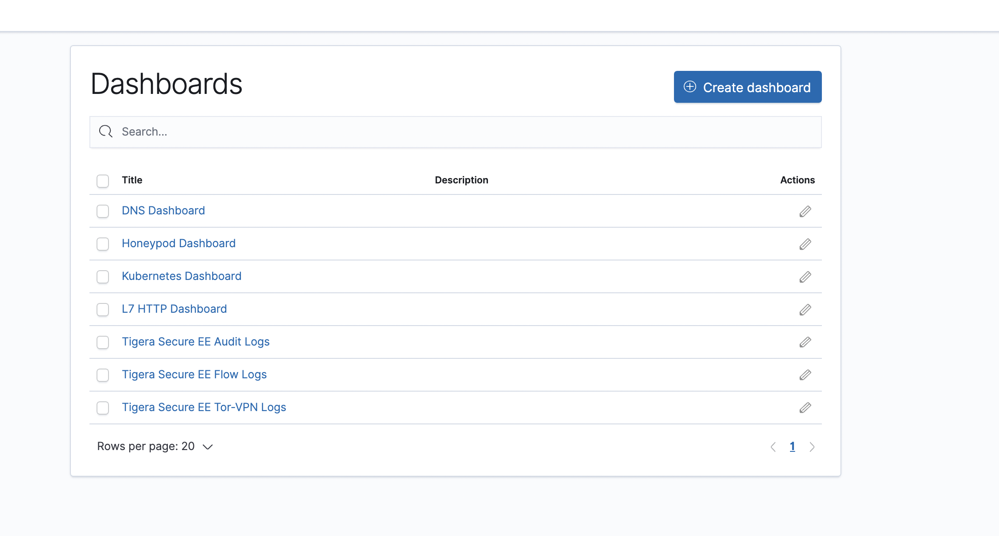
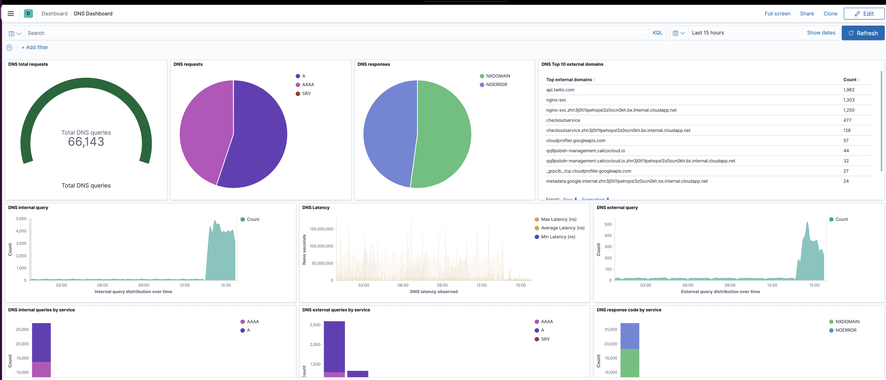

# Kibana Dashboard

**Goal:** Explore Calico observability tools in Kibana UI.

## Calico observability tools

1. Kibana dashboards

    The `Kibana` components comes with Calico commercial offerings and provides you access to raw flow, audit, and dns logs, as well as ability to visualize the collected data in various dashboards.

    

    Calico provide Some of the default dashboards you get access to, including are DNS Logs, Flow Logs, Audit Logs, Kuernetes API calls, L7 HTTP metrics etc, and you can also customernize different dashboard. 

2. DNS dashboards   

    The `DNS` dashboard will give you a general idea about how DNS behave in your cluster, including internal & external queries, also DNS latency as it shows below.

     

3. L7 logs    

    The `L7` dashboard will give you all details related to `http` protocol including method, response code and url etc. We will enable L7 logs in later module.

     

4. Flow logs

    The `ee flow log` dashboard will give you all details related to every flow logs including deny & allow action and the reporter, you can find out kubernetes context as well while expand each flow logs.

     

5. Audit logs

    The audit logs dashboard is useful as you can filter them by `username` and `verb`, example below is filter by user `cc-demo@tigera.io` which means the action is from UI manager user. We will enable k8s audit logs in later module.

     

---

[:arrow_right: Packet Capture](./dynamic-packet-capture.md)

[:leftwards_arrow_with_hook: Back to README.md](../README.md)