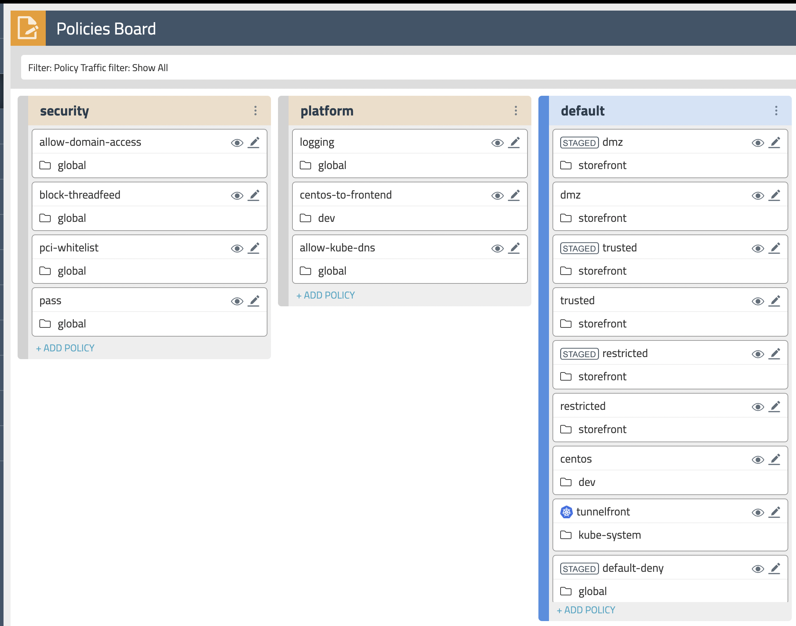
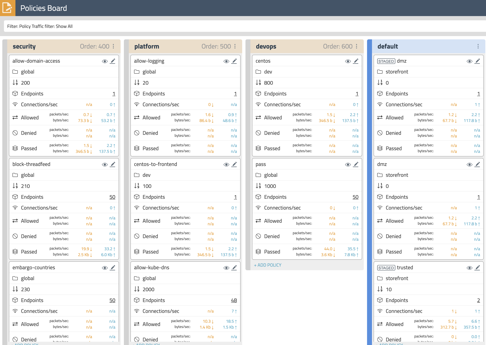
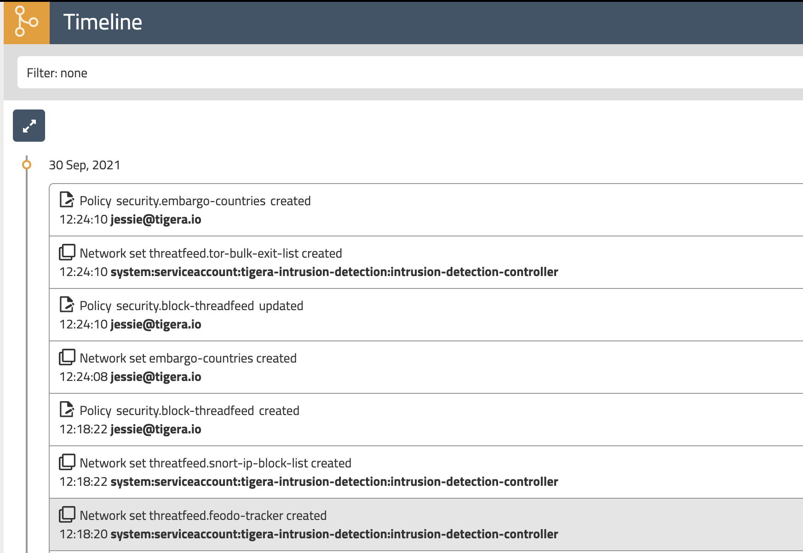

# Calico Cloud UI and Policy Management

**Goal:** Explore Calico observability tools in manager UI.

## Calico observability tools

1. Dashboard

    The `Dashboard` view in the Enterprise Manager UI presents high level overview of what's going on in your cluster. The view shows the following information:

    - Connections, Allowed Bytes and Packets
    - Denied Bytes and Packets
    - Total number of Policies, Endpoints and Nodes
    - Summary of CIS benchmarks
    - Count of triggered alerts
    - Packets by Policy histogram that shows allowed and denied traffic as it is being evaluated by network policies

    

2. Endpoints

    The `Endpoints` view lists all endpoints known to Calico. It includes all Kubernetes endpoints, such as Pods, as well as Host endpoints that can represent a Kubernetes host or an external VM or bare metal machine. We will elaborate host endpoints in later module.

    

3. Policies Board

    The `Policies Board` shows all policies deployed in the cluster and organized into `policy tiers`. You can control what a user can see and do by configuring Kubernetes RBAC roles which determine what the user can see in this view. You can also use controls to hide away tiers you're not interested in at any given time.

    

    By leveraging stats controls you can toggle additional metrics to be listed for each shown policy.

    

4. Audit timeline

    The `Timeline` view shows audit trail of created, deleted, or modified resources.

    

---

[:arrow_right: L7 logging](./enable-l7-visibility.md)

[:leftwards_arrow_with_hook: Back to README.md](../README.md)