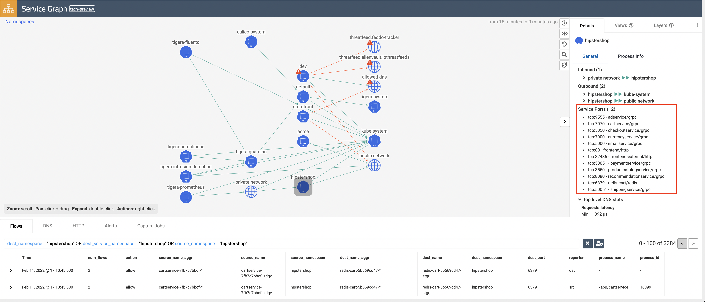

# Service Graph

**Goal:** Explore Calico observability tools in manager UI.

## Calico observability tools

1. Service Graph

    The dynamic `Service Graph` presents network flows from service level perspective. Top level view shows how traffic flows between namespaces as well as external and internal endpoints.

    

    - When you select any node representing a namespace, you will get additional details about the namespace, such as incoming and outgoing traffic, policies evaluating each flow, and DNS metrics.
    - When you select any edge, you will get details about the flows representing that edge.
    - If you expand a namespace by double-clicking on it, you will get the view of all components of the namespace.

2. Flow Visualizations

    The `Flow Visualizations` view shows all point-to-point flows in the cluster. It allows you to see the cluster traffic from the network point of view.

    

---

[:arrow_right: Kibana dashboard](./kibana-dashboard.md)

[:leftwards_arrow_with_hook: Back to README.md](../README.md)